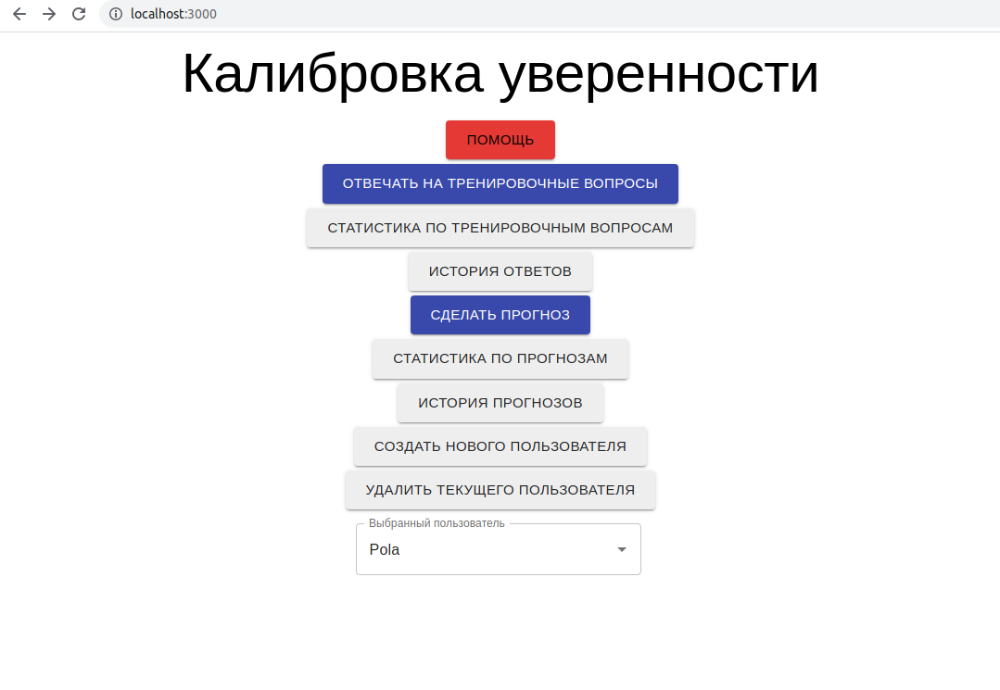
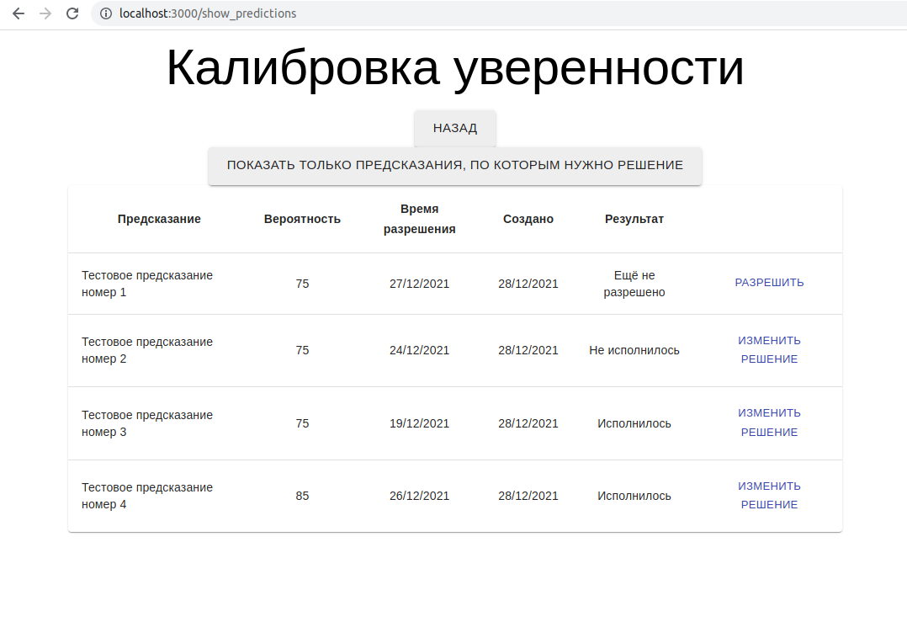
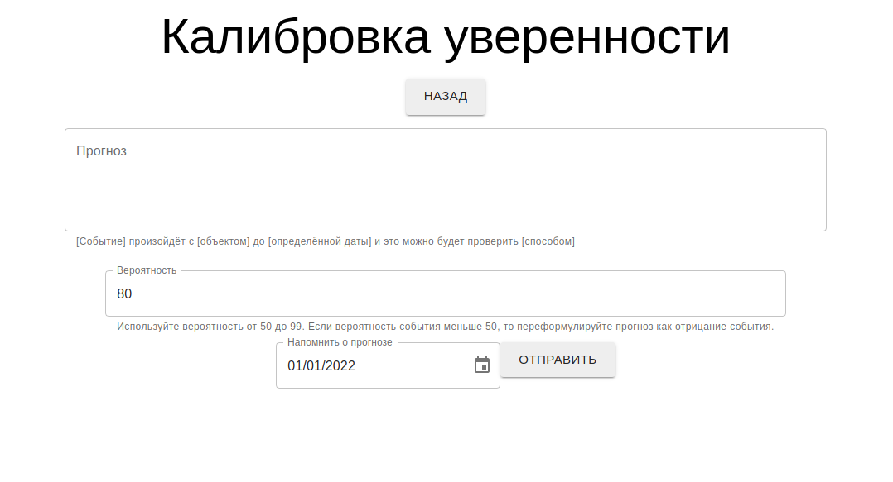

# Prediction Calibration App

This app allows you to improve your precision in making probablistic estimates what will happen in the future. You make predictions noting level of confidence in your prediction. Then you gather statistics over predictions see where your world model deviates from reality and try to improve your score. This is rationality exercise described in book "Why Some People See Things Clearly and Others Don't" by Julia Galef. Abridged description is provided in Help section of this App.

# Features

- Bank of 100 random science questions
- Allows to make predictions and store their resolve date and probability
- Statistics over answered training questions and predictions
- Also you can review which questions/predictions you answered correctly and where you've been mistaken
- Supports multiple users
- Client-server architecture with REST API and Web-interface - you can access running app from any browser on any device in your local net
- Integration tests for backend with pytest
- Only Russian language right now, sorry :)

# Interface







# Requirements

### Frontend:

- node 14.1.0+
- npm 8.3.0+

### Backend:

- python 3.10 (actually 3.8 will probably do just fine)
- flask 2.0.2
- flask-SQLAlchemy 2.5.1
- pytest 6.2.5

# Running

Frontend:
```
cd calibration_client
npm ci # first time or after pulling changes to package list
npm start
```

Backend
```
cd calibration_backend
python recreate_db.py  # only first time
python calibration_backend.py
```

# TODOs

- Page for adding questions online
- Loading questions from more files
- Selecting topic for exercise questions
- Good error alerts when answering questions from multiple browsers or when Promises are rejected instead of just changing title for page
- Fix blinking "Loading..." - preload some data
- English translation (maybe)
